# Mastodon 长毛象入门指南

## 前言

本篇博文是 [Mastodon 完全使用指南 (用户篇)](https://blog.holger.net.cn/posts/a-users-guide-to-21st-century-sns/) 的简洁版，将会向长毛象新住民介绍长毛象的使用方法及注意事项。如果你还不知道长毛象是什么，可以阅读[欢迎加入长毛象宇宙！](https://blog.holger.net.cn/posts/welcome-to-mastodon/)

## 快速开始！

### 选择站点

加入长毛象前你需要先选择一个适合自己的社区 —— 就像在注册邮箱前选择是 163 邮箱还是 QQ 邮箱一样 (当然啦，无论你选择哪个社区都可以和整个长毛象宇宙互动！)，本文将会列出一些较大且在稳定运行的社区供大家参考，大家可以在使用过程中感受不同的氛围并最终找到属于自己的社区：

- [Island 岛屿](https://mast.dragon-fly.club/about) (786 人 / 6,666 字): 这里是属于每一个人与众不同的岛屿，然而每座岛屿间却又紧密相连。来建设专属于你的岛屿吧！在这里找到一个不一样的自己。无论世界多么纷纷扰扰，在这里，总会有你所向往的一片宁静……
- [g0v.social](https://g0v.social/about)(3.4k 人 / 繁中 / 500 字): 去中心化社群架設的去中心化社群網站 
- [o3o / 嘟站](https://o3o.ca/about) (10.4k 人 / 500 字): 欢迎来到 o3o / 嘟站！这是一个泛话题社区，无论你的兴趣点是什么，你都可以自由地通过发布 “嘟嘟” 来吐槽一切、摸鱼扯皮。
- [长毛象中文站 (草莓县)](https://m.cmx.im/about)(16.1k 人 / 600 字): 长毛象中文站是一个开放，友好，有爱的社区。长毛象中文站主题为喵，汪，各种动物，社交，科技，编程及生活。发言内容只要没有明显违法内容均不禁止。无论你的兴趣点是什么，我们欢迎友好、热情、乐于分享的朋友。
- [呜呜 w (> ʌ <) w](https://wxw.moe/about)(15.9k 人 / 20,000 字): 一个 泛 ACGN 实例，讨论主题不限～

(社区列表来自 [joinmastodon.org](https://joinmastodon.org/communities/general) | 截至 2022/5/1)

选择社区时要记得**阅读其社区规则及用户条款**，如果社区开放了公共时间轴也可以点进去预览社区的嘟文主题与氛围。你可以在不同长毛象社区中开设小号，但请不要创建三无账号 (即**无头像、无昵称、无嘟文**)。体验一段时间后就可以在你喜爱的社区中开始你的旅程啦！

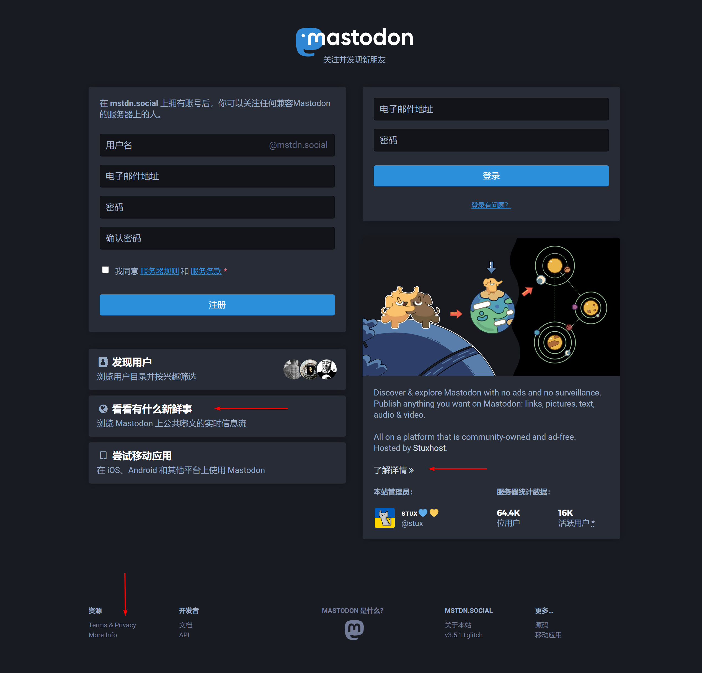

*附：长毛象社区列表*

- [长毛象官方列表](https://joinmastodon.org/communities/general): 仅收录手动申请社区，数量较少，但都比较稳定，打开后在右上角选择中文进行筛选 (部分地区访问可能不太稳定)
- [Instances Social](https://instances.social/list#lang=zh): 爬取的各社区列表，不太全面 
- [FediDB](https://fedidb.org/network): 较全，但无法筛选语言

Tip: 可在[长毛象导航 (*@list@mstdn.one*)](https://mstdn.one/@list/108209081521073966) 中关注社区列表更新
[长毛象导航](https://mstdn.one/@list/108209081521073966)是一个非官方的中文长毛象导航，这里有很多使用贴士、有趣的嘟主及机器人账号推荐，欢迎大家关注！

### 注册

长毛象宇宙中除**用户名**外还有一段**域名**作为你在平台中的 ID，我们不妨将其类比为邮箱地址：`holgerhuo@dragon-fly.club`。如果你在 `dragon-fly.club` 社区中注册了一个用户名为 `holgerhuo` 的账号，那么你的完整用户名就是 `@holgerhuo@dragon-fly.club`，这也是你在长毛象宇宙中的唯一 ID，和亲友分享你的账号时用这个 ID 就可以啦！

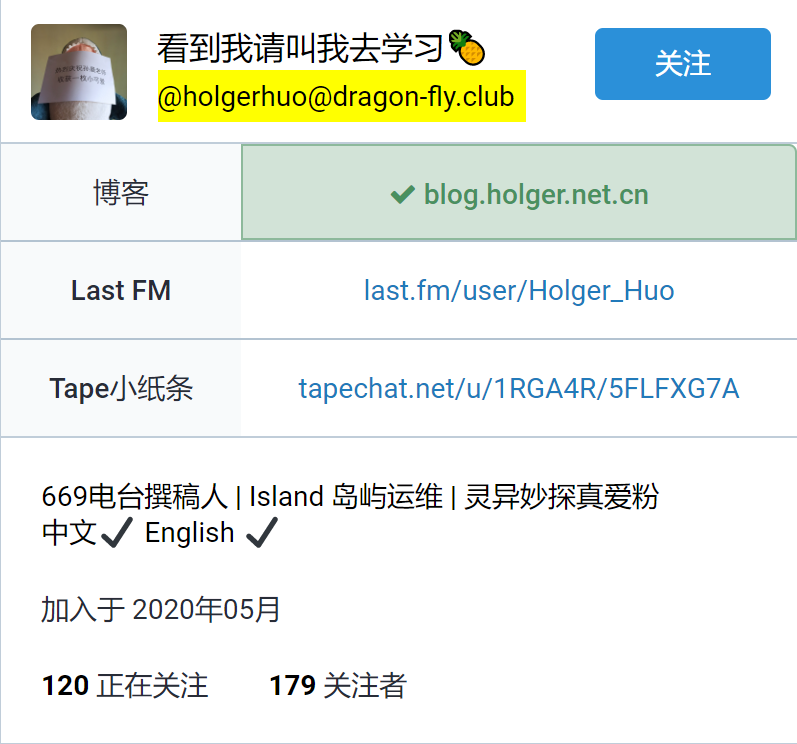

> **用户名**只能使用字母 + 数字 + 下划线的组合且**不可修改**，请大家在创建时务必考虑清楚；登陆后可以修改自己的**昵称** (使用任意字符 + 本站的 emoji)。
> 大部分中文社区注册后需要管理员批准，可能要等待一天左右的时间；如果不想等待，也可以去社区列表中探索无需批准即可加入的社区，不要忘记所有长毛象社区都可以互联噢！

打开想要注册社区的主页，填入用户名、邮箱地址 (推荐使用 Outlook/Gmail) 及密码，**阅读规则及服务条款**，如需填写入站理由请**根据要求认真填写**，随后点击注册就可以啦！

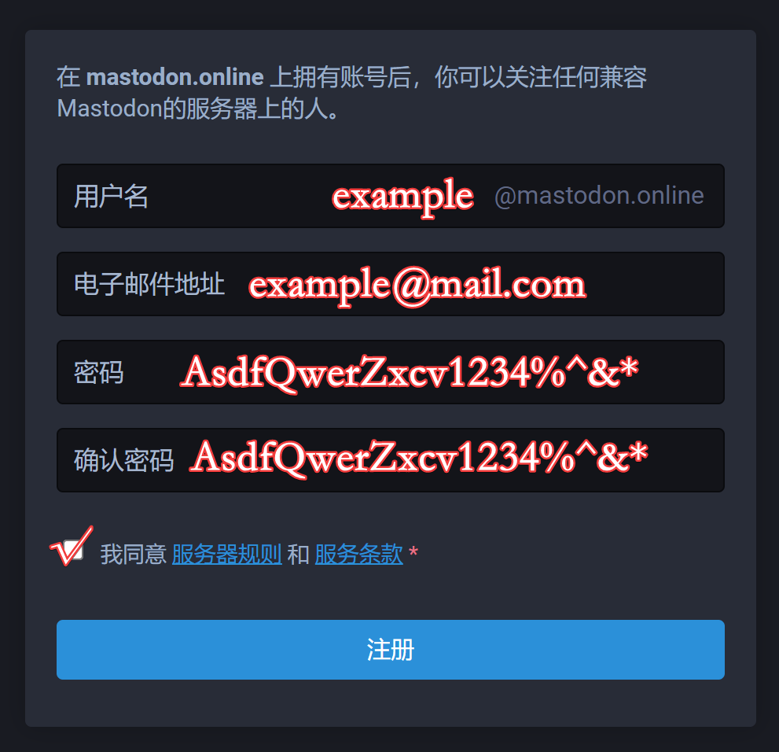

这时打开邮箱查收邮件 (如果没有收到可以**检查垃圾箱**；10 分钟后还没有收到可以在网页中检查你输入的邮件地址是否正确，更改地址或者请求重发；如果一天后仍没有收到确认邮件请向站长发送邮件确认)，然后点击**验证电子邮件地址**确认即可。

管理员批准后，你就会收到一封含有你**长毛象 ID** 的邮件，记下你的 ID 并分享给好友，返回 Web 界面就可以开始你的长毛象之旅啦！

首次启动时，长毛象会为你推荐一些**近期发言活跃并且和其他用户互动较多**的账号，你可以根据他们的简介来关注感兴趣的嘟主，或是直接跳过进入~~空荡荡主页~~。

### 选择客户端

#### 电脑端

电脑端推荐使用 *Chrome/Firefox/Edge/Safari 浏览器*来使用长毛象。打开网站后，浏览器会提示你是否**允许接受推送通知**；地址栏后方会有**添加到桌面**图标，大家可以根据自己的喜好是否添加。

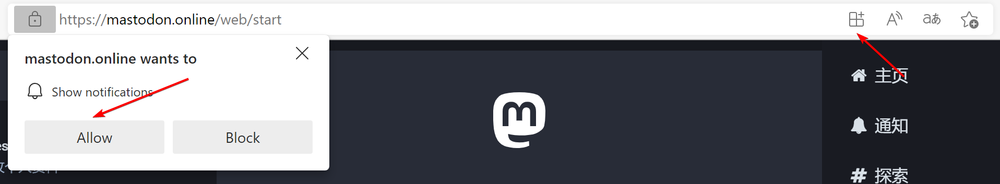

#### 安卓端

如果你的手机中装有 Chrome 可以直接在 Chrome 中打开社区并登录，屏幕下方会提示你将其**添加到主屏幕**，点击后稍等一下就可以在主页上看到长毛象图标啦！不要忘记打开通知权限来接收消息推送！

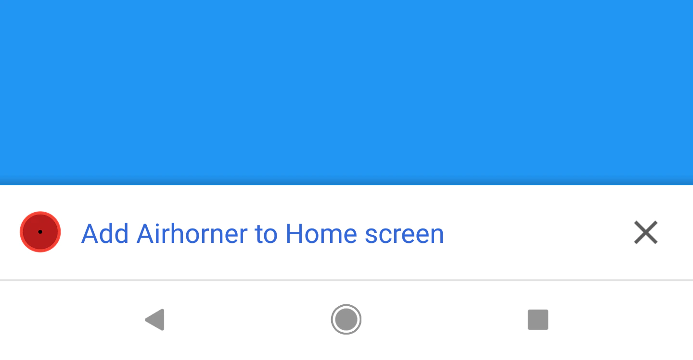

> Monado 嗼站有提供非常完善的 PWA 程序教程，大家可以选择阅读: https://docs.monado.ren/user/pwa/

如果你不常使用 Chrome，那么建议下载一款独立客户端来使用长毛象。本文将介绍较为流行且易用的 **Tooot** 客户端：

打开 Tooot 官网 ([tooot.app](https://tooot.app/))；点击 `tooot-latest.apk`，随后安装应用并启动。在社区地址一栏填入你的社区并在弹出的浏览器窗口登录，同意授权就可以进入啦！

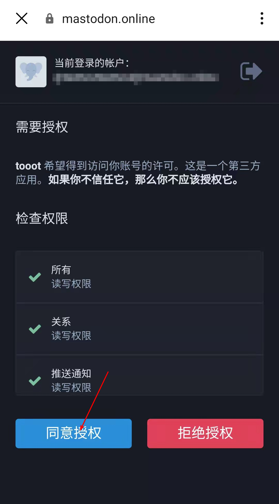

#### iOS 端

iOS 用户可以在 App Store 中搜索 *Metatext* 并下载第一个结果，安装启动后输入社区地址并在 Safari 中登录，然后就可以进入 Metatext 啦！

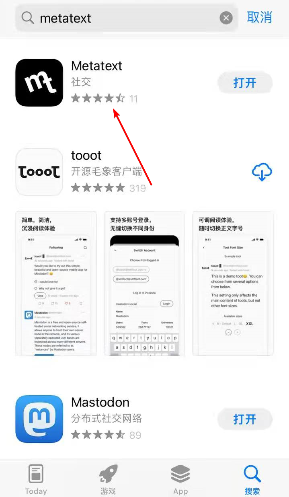

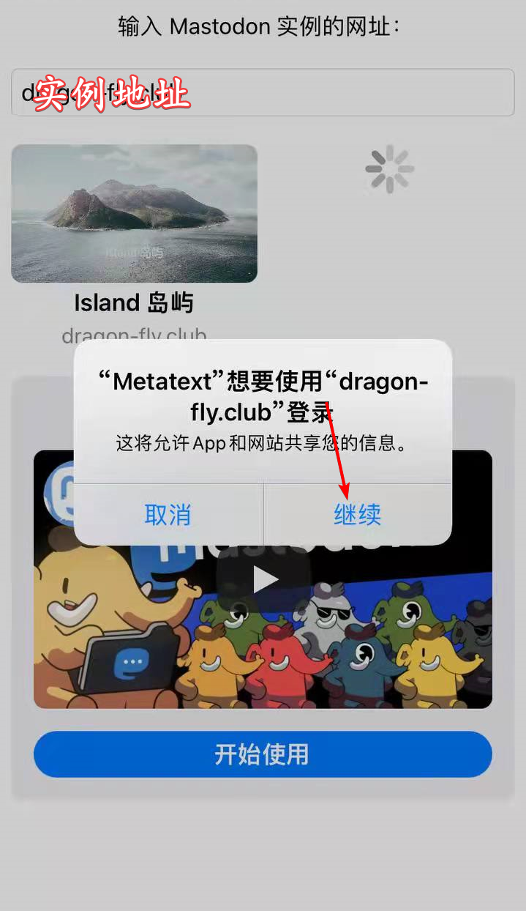

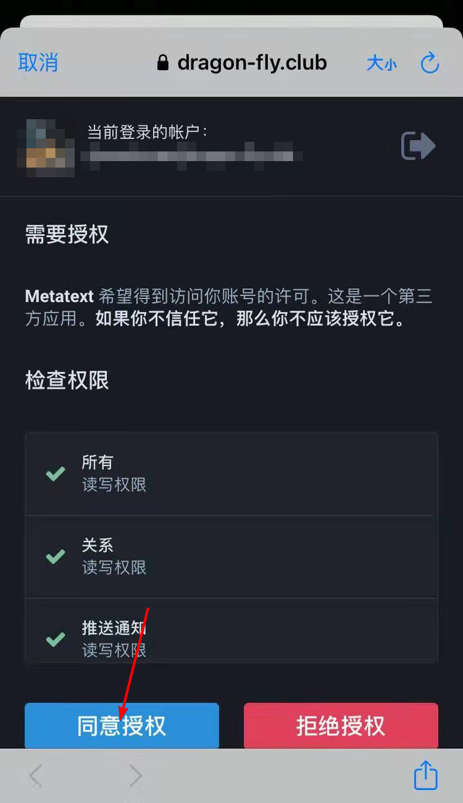

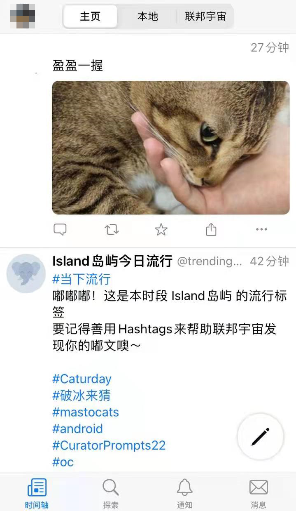

### 使用

#### 添加好友

如果你的好友向你发送的是**长毛象 ID**，如 `@holgerhuo@dragon-fly.club`，将其粘贴到搜索框中搜索就可以啦！如果你的好友发来的是链接，可以将链接粘贴至搜索框像 ID 一样搜索，或者用浏览器打开链接，点击关注，随后填入**你的长毛象 ID** 来继续操作：

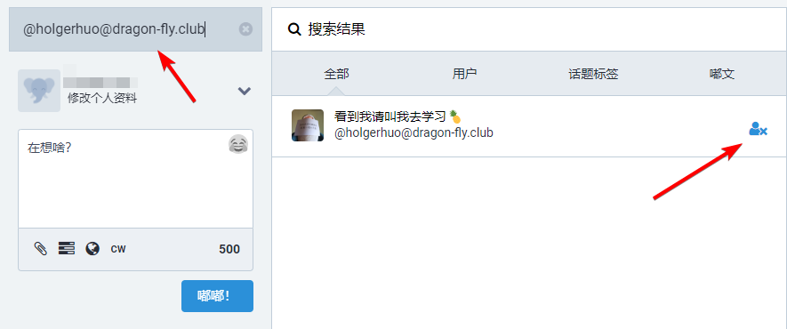

#### 转发 or 回复？

刚来到长毛象的你可能会把转发与回复的图标搞混。在默认界面中，第一个**单箭头**按钮代表**回复**嘟文，第二个**循环双箭头**意味着**转发**。点击回复后会弹出撰写嘟文界面来进行回复；而点击转发则只会看到按钮的动画效果，没有其他提示。各位小伙伴们一定注意不要点错啦，不然会给嘟主留下一群只有 @了嘟主的空嘟文 orz。第三个小星星按钮是收藏 (即点赞)。

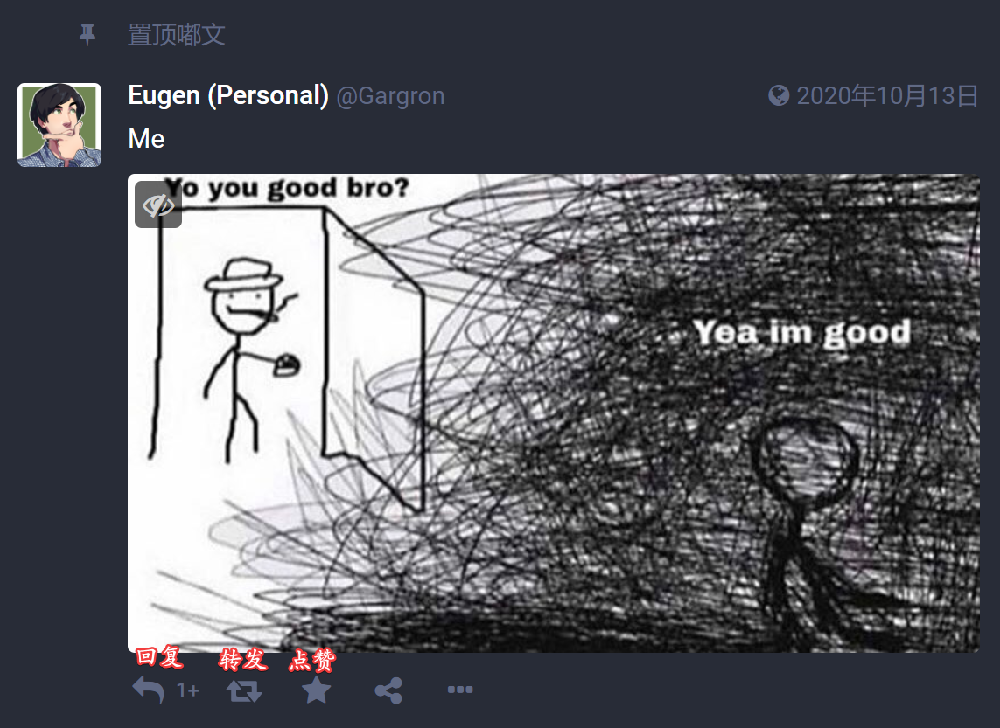

#### 主页、本站、跨站、探索？如何搜索嘟文？？

**主页时间轴**就像是你的微博 / Twitter 主页，包含了所有你关注好友的嘟文；**本站时间轴**存储着你所在社区的嘟文，可以用来发现与社区主题相关的有趣嘟文；**跨站时间轴**则涵盖了全部长毛象网络中的嘟文，这里的时间线比较庞大，消息刷新得也很快，在无聊的时候可以速览一下跨站轴来了解正在发生的事情。

**主页时间轴**默认仅会展现 **400** 条嘟文 (Tip: 岛站将此限制提升至 10000 条)，如果你关注了较多嘟主要记得及时查看不然就会消失在茫茫嘟海中啦！

**探索页面**展示了互动次数最多的**嘟文**、**链接**及 ***Hashtags***，可以类比为**微博热搜榜**，也是一个发现嘟主及了解正在发生什么的好地方。

许多社区并不能直接搜索嘟文，但你可以在百度或 Google 中使用 `site:目标社区+关键词`来进行搜索。如果你不希望被搜索引擎索引，可以在设置中选择**禁止搜索引擎建立索引** w！

#### 发表嘟文

作为一款「微博」型社交平台，长毛象每条嘟文的字数限制为 500 字 (大部分社区都上调了字数限制)，你可以发布投票或者插入媒体文件，并为嘟文设置内容警告。如果上传了图片不要忘记给视障人群加上无障碍文字噢！

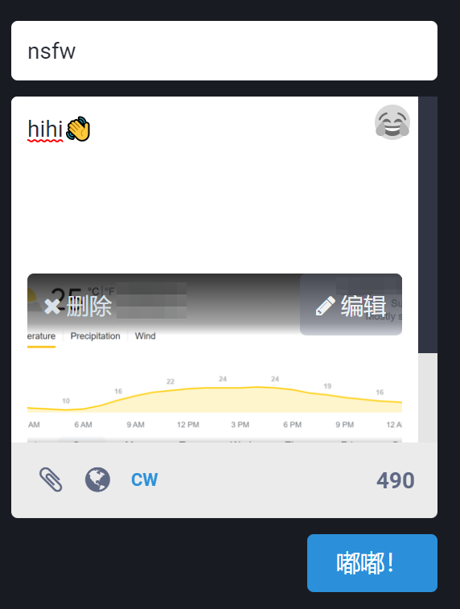

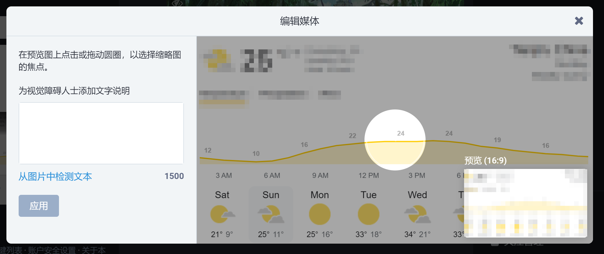

某些情况下，你上传的视频可能会需要一定时间等待服务器转码；如果较长时间依旧没有响应可以尝试刷新后重试发送。使用 **Hashtag/@他人 / 表情短代码**时，请注意在代码前后插入空格，没有空格则不会解析，如下图：

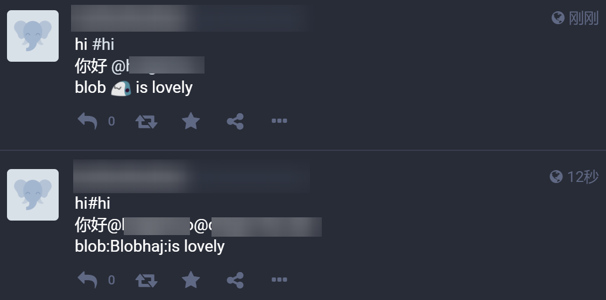

#### 如何保护自己

作为一款开放社交平台，你或许会因某些用户 / 嘟文感到不适。不要担心，长毛象有着健全的用户保护机制。遇到不喜欢的用户时，可以给他加急安排上隐藏 / 屏蔽。隐藏用户后，你将再也不会收到对方的信息或通知；如果屏蔽了对方，那么他也不能再看到你的资料与嘟文。如果这位用户违反了你所在社区的规定，可以直接举报用户，让其受到长毛象的制裁！

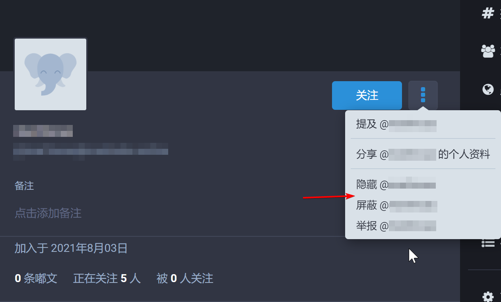

## 进阶使用

### 版聊

**版聊**类似于群组功能，可以让你发表的嘟文送达至关注了某一话题的全部用户。

官方的版聊账号为 `@board@ovo.st`，在搜索框中键入此 ID 并关注，之后就可以接收到来自全部长毛象用户向版聊发送的嘟文啦！(注：版聊目前每天收到的消息还是挺多的，大家选择性关注) 如果想向版聊发送消息，直接在嘟文中 `@board@ovo.st` 就可以啦！ (记得在 @后加入空格 w)

除了 `@board@ovo.st`，你还可以创建自己的群组，使用方法就是关注并 `@话题@ovo.st` 啦～如 `@welcome@ovo.st`。

发送成功后你将收到版聊转发了你嘟文的提示，然后就等待热情的象友们给你的回复吧！

## 结语

本文介绍的仅仅是联邦宇宙的冰山一角，除长毛象外，还有更多丰富有趣的功能等待你去发现！不过…… 下面的内容就交由你来探索好啦！相信你会在这浩瀚的联邦宇宙中找到一片属于自己的天地！	

> 本文章以 [CC BY-NC-SA 4.0](https://creativecommons.org/licenses/by-nc-sa/4.0/) 授权分发
>
> 感谢 [@holgerhuo@dragon-fly.club](https://mast.dragon-fly.club/@holgerhuo) [@yingmo@dragon-fly.club](https://mast.dragon-fly.club/@yingmo) [@lgE@mstdn.one](https://mstdn.one/@lgE) [@error@m-i.im](https://m-i.im/@error)[@martincao@dragon-fly.club](https://mast.dragon-fly.club/@martincao) [@keeper@dragon-fly.club](https://mast.dragon-fly.club/@keeper) [@bgme@bgme.me](https://bgme.me/@bgme) 共同撰写本文
> 
> 感谢象友们提供的宝贵建议！