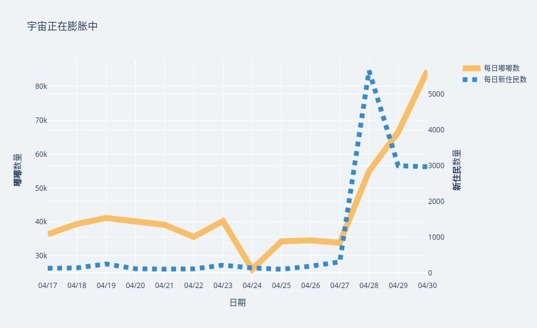
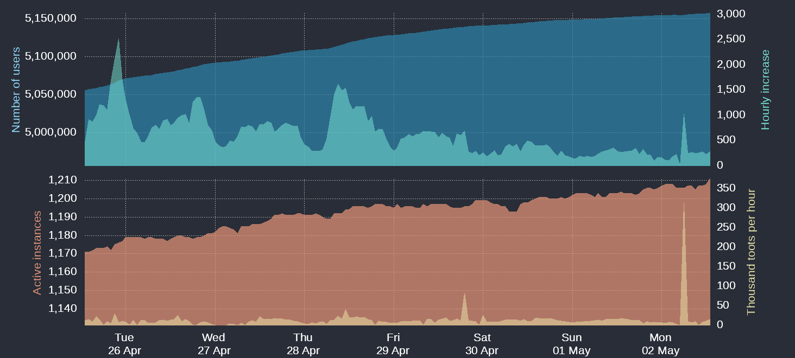
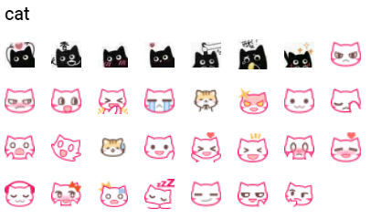
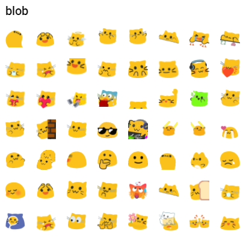
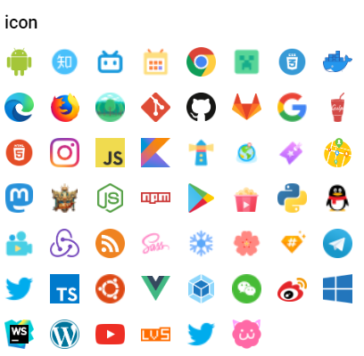
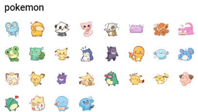
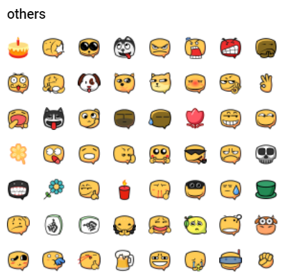
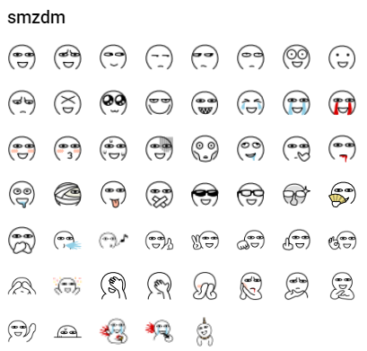

# 欢迎加入长毛象

## 致微博 / Twitter 用户

你有没有想过这样的一个社交平台？它不会像夹总微博一样动不动就把你精心绘制的作品 *404*，毫无预警地隐藏你的微博，让你不知所措；永远也不会有一个 “**马斯克**” 能够从天而降，宣布私人拥有了整个平台并控制了你的数据；它来去自由，一个邮箱就可以拥有整个世界，离开时，你还可以打包自己的行囊，留下你所创造的美好瞬间；只有你能掌握获取什么样的资讯，而不会收到广告算法的精准推送，整个社区都与广告骚扰为敌，从不给任何影响社交体验的行为留下夹缝生存……

听到这里，或许你已经开始感到不可思议了：这样的世外桃源…… 真的有可能存在？？没错！这样乌托邦一般的存在，便是**长毛象** (及其背后的整片联邦宇宙)。

## 长毛象是什么

<iframe title="长毛象是什么？" width="560" height="315" src="https://peertube.co.uk/videos/embed/559ab664-22c3-4986-9e20-f32afa957648?subtitle=zh&amp;warningTitle=0" frameborder="0" allowfullscreen="" sandbox="allow-same-origin allow-scripts allow-popups"></iframe>

**长毛象** (*Mastodon*) 是一款**微博客型**社交平台，你可以发布嘟文，分享图片，关注 /@你的好友，点赞或是评论 —— 就像你能在微博 / Twitter 中做到的那样。然而长毛象的与众不同之处在于长毛象是一个**平台**，在这个平台上有各式各样性格各异五彩缤纷的独立**社区**，而每一个社区都可以在长毛象这个平台上交流互动；更赞的是，你甚至可以开创一个属于自己的长毛象社区。

长毛象主打**纯粹的社交** (不同社区可能有不同理解)，目前主流的社交平台充斥着各种各样的广告信息、由推荐算法控制的主页时间轴以及太多太多与社交无关的内容，早已背离了其社交的本质，而长毛象的目的就是把原本的社交体验交还予你。

随着越来越多的中文长毛象社区成立，中文长毛象用户在刚刚过去的一个月里 (2022/4) 突破了 **10w+**，**活跃用户达到近 2w 人**。

## 长毛象的优点

### 无广告、无推广、无算法，你的信息由你掌握

大多数长毛象社区都不是由商业公司运作的，背后也没有商业支持，全部由个人运营，这意味着不会有人获取你的隐私数据卖钱，也不会有人把你所在的社区收购；如果这还不够，你还可以在家搭建一个属于你一个人的社区，完全掌握你的个人数据。

通过社区自管理，长毛象将社区自主权交还给了社区，进而赋予用户，在一定程度上扭转了平台方与用户之间不对等的关系，限制平台凌架于用户之上的权利。举个例子：假设某一天一个长毛象社区决定公开用户IP，在这个社区上的用户如果不喜欢可以直接选择迁移到另一个社区而无需担心丢失自己的社交关系；其他社区也完全没有义务跟进这一决定——毕竟每个社区都拥有社区自主权。

长毛象上的**时间轴**是真正意义上的*时间*轴，不会受到热搜算法的控制，你只会看到来自你关注的嘟主或整个社区 / 平台内的信息流。丰富的消息过滤机制让你全权掌握你会看到什么；而*版聊*、*Hashtag* 等等又能让你自主发掘你所喜爱的内容。

广告商、流量博主在长毛象宇宙中毫无生存空间，每一个用户都会主动抵制滥发广告等骚扰行为，而整个平台联动的屏蔽机制也让来自某个社区的捣乱分子无处遁形。

无论你在哪个社区，你都可以随时下载你在平台上创建的内容，自由迁移你的关注者到另一个社区的账号中去，不受社区限制。

### 不断茁壮的宇宙

长毛象中目前有 **40 万活跃用户** (510 万 + 总注册用户)，中文长毛象宇宙活跃用户近两万人，不同的社区主题涵盖了二次元、艺术、科技、学术、音乐、游戏、美食、LGBTQ+。不仅如此，来自世界各地的不同政府、机构纷纷加入长毛象，还有像清华上交等高等学府构建起了校园专属社交网络。

这项数据还在呈指数级爆发增长，你的到来将会使长毛象宇宙更加丰富多彩。

### 超多有趣的自定义 Emojis

在长毛象中，每一个社区都有着数不尽的自定义 Emojis，不必为某一个特定平台的独占表情包所困扰，在这里你可以一网打尽，如果你有创作功底，还可以为你的社区贡献表情包噢！

部分自定义 Emojis 一览

### 无限可能的机器人

你有没有体会过在自己电脑上搭建 QQ 机器人的恐惧？在长毛象上，你可以自由搭建推送 / 转发、互动、定时播报机器人，而且长毛象宇宙里已经存在着许多有趣的机器人：提醒你饮茶休息的波特、自动转发猫猫图片的波特、帮助你做选择的占卜波特…… 大部分的源码都开源在了 GitHub 上可以由你自由发挥加入更多灵感创造无限可能！

### 你的社区你做主

“朋友圈只能发表 9 图，微博字数上限不够发泄你的表达欲，无法直接分享音视频”，这些问题在长毛象中都可以被解决。你可以对你创建的社区任意魔改，自由调整字数、图片、文件类型的限制 —— 只要遵从长毛象协议就可以保持连接。联邦宇宙中还有如 *PeerTube*(视频分享 / 类似 Bilibili)、*FunkWale*(音频创作 / 类似网易云)、*Writefreely*(文章创作 / 类似 Lofter) 等社区供你选择，最棒的是这些社区都能与长毛象互通互联。

### 开放协议

长毛象背后是开放的 [Activity Pub 协议](https://www.w3.org/TR/activitypub/)。如果你是一名开发者，借助 Activity Pub，你可以轻松将自己的设想落地成为现实。只需接入 Activity Pub 就可以与正在膨胀的长毛象宇宙原生互动，而无需向腾讯 / Twitter 交保护费。

## 如何加入？

听到这里，你是否已经心动想要加入长毛象了呢？以下是一些可以帮助你快速上手的文章，你也可以直接前往[官方网站](https://joinmastodon.org/) / [嗼站运营的镜像](https://docs.monado.ren/)了解更多信息，或者挑选一个喜爱的社区，开始你的长毛象之旅！

- [Mastodon 长毛象入门指南](https://blog.holger.net.cn/posts/a-beginners-guide-to-21st-century-sns/) (推荐新用户阅读) 
- [长毛象（Mastodon）：更尊重用户的社交平台](https://pullopenbluebox.wordpress.com/2020/06/30/mastodon-introduction/)
- [长毛象 Mastodon 食用指南](https://jings.blog/misc/how-to-use-mastodon.html) (略显过时)

长毛象仅仅是联邦宇宙的冰山一角，相信在你更深一步的探索中能够找到这一宇宙更多的亮点与不同，祝你在这里找到属于自己的一片小天地！

> 本文章以 [CC BY-NC-SA 4.0](https://creativecommons.org/licenses/by-nc-sa/4.0/) 授权分发
>
> 感谢 [@holgerhuo@dragon-fly.club](https://mast.dragon-fly.club/@holgerhuo) [@yingmo@dragon-fly.club](https://mast.dragon-fly.club/@yingmo) [@lgE@mstdn.one](https://mstdn.one/@lgE) [@error@m-i.im](https://m-i.im/@error)[@martincao@dragon-fly.club](https://mast.dragon-fly.club/@martincao) [@keeper@dragon-fly.club](https://mast.dragon-fly.club/@keeper) [@bgme@bgme.me](https://bgme.me/@bgme) 共同撰写本文
> 
> 感谢象友们提供的宝贵建议！